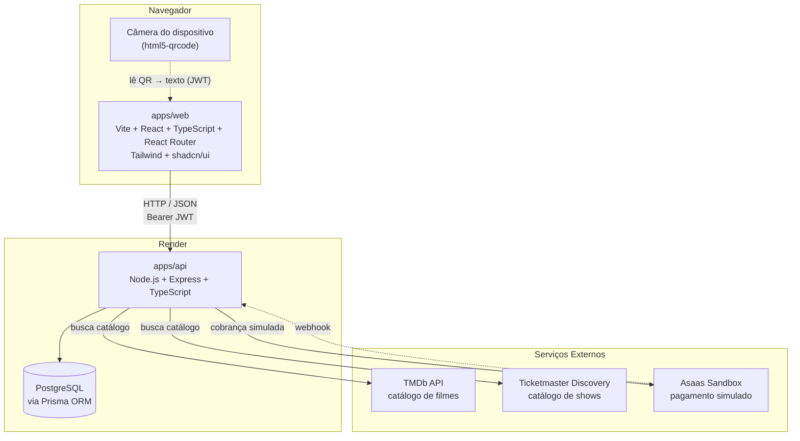

# Decisões de Arquitetura

> Registro do que foi decidido tecnicamente e por quê. Cada escolha foi
> discutida e validada antes de qualquer implementação — este documento existe
> para que qualquer decisão que pareça não-óbvia numa leitura rápida do código
> tenha sua justificativa registrada aqui.

> **Método.** As decisões deste documento são minhas. Usei IA como ferramenta
> de análise — levantar alternativas, expor trade-offs, checar fatos contra a
> documentação oficial — mas a escolha final em cada linha foi minha, e em
> parte dos casos contrariou a recomendação inicial da ferramenta. O runner de
> testes é um exemplo: a sugestão era Vitest, optei por Jest pela maturidade em
> testes de integração contra banco real. O registro de onde a IA foi
> usada está em `docs/AI_USAGE.md`.

## Stack Principal

| Camada | Escolha | Motivo |
|---|---|---|
| Organização do repositório | Monorepo (`apps/web`, `apps/api`) | Um único clone para o avaliador rodar tudo; Docker Compose orquestra front + back + banco juntos; commits de ambos os lados ficam no mesmo histórico, mostrando o processo de forma unificada |
| Linguagem (front e back) | TypeScript | O domínio é denso em enums e transições de status (`Reservation`, `Ticket`, `Seat`, `Payment`, `Event` — ver `SPEC.md` §4.2): tipar essas transições transforma em erro de compilação o que em JavaScript seria bug silencioso descoberto só em runtime. Também é o que torna real a type-safety do Prisma citada abaixo — em JS puro os tipos gerados pelo client existem, mas nada impede passar um campo ou enum errado. Aplicado nos dois apps para manter uma linguagem só no monorepo |
| Variáveis de ambiente | `--env-file-if-exists` nativo do Node, sem `dotenv` | O Node 24 carrega arquivos `.env` por conta própria, o que elimina uma dependência. A variante `if-exists` foi escolhida em vez de `--env-file` porque em produção não existe arquivo `.env` — Render e Docker injetam as variáveis pelo próprio ambiente — e a versão estrita abortaria o processo na ausência do arquivo. Cada app tem um `.env.example` versionado como modelo; o `.env` real nunca vai para o repositório |
| Versão do TypeScript | 6.x, não a 7 | A 7 já está disponível, mas o `typescript-eslint` ainda não a suporta — a faixa que ele aceita para no 6.0. Sem ele não há lint com informação de tipo, que é justamente o que pega promise não aguardada dentro de uma transação. Ficar na 6 custa nada: o projeto não usa nenhum recurso exclusivo da versão nova |
| Datas e fuso | Tudo em UTC, com `TZ=UTC` no processo e um utilitário único | O Prisma já grava em UTC, mas o processo Node roda no fuso da máquina — o que faria a mesma regra de prazo dar respostas diferentes aqui e no servidor. Fixar o fuso elimina isso. As duas regras sensíveis a tempo (expiração de 15 minutos, janela de 24 horas para cancelar) ficam num utilitário só, em vez de cada controller fazer sua própria conta de horas |
| Formato de módulo (API) | CommonJS | Decisão tomada em função do Jest: rodar a suíte sobre ESM exige a flag `--experimental-vm-modules` no Node e configuração adicional no `ts-jest`, que é justamente a fricção apontada como ponto fraco do Jest quando ele foi escolhido no lugar do Vitest. Com CommonJS, o Jest roda sem nenhum desses ajustes. Na prática o `tsconfig.json` usa `module: nodenext`, que emite CommonJS porque o `package.json` da API não declara `"type": "module"` |
| Front-end | Vite + React (sem framework tipo Next.js) | O back-end já é servido separadamente por Express — um framework full-stack como Next.js adicionaria complexidade (SSR, rotas de API, Server Components) sem nenhum benefício real, já que a aplicação é 100% logada e não depende de SEO |
| Roteamento (front) | React Router | Padrão maduro do ecossistema React sem framework full-stack; cobre rotas protegidas por papel e rotas dinâmicas sem fricção |
| Estilização | Tailwind CSS + shadcn/ui, customizado | Tailwind acelera estilização mantendo consistência; shadcn/ui (construído sobre Radix UI) resolve componentes complexos (modal, dropdown, select) com acessibilidade pronta — porém com paleta, tipografia e componentes customizados para fugir da aparência padrão reconhecível ("AI slop"). Tailwind 4: a configuração é feita em CSS via `@theme`, sem `tailwind.config.js` |
| Identidade visual | Tema "ingresso impresso": papel off-white, tinta quase preta, um acento vermelho, cantos retos, fonte Archivo | Escolhida entre três direções avaliadas. Detalhada mais adiante |
| Back-end | Node.js + Express | Framework leve e direto, adequado ao escopo do desafio sem overhead de convenções de frameworks maiores (ex: NestJS) |
| ORM | Prisma 7 | Migrations automáticas, schema versionável e transações com update condicional — o que impede vender o mesmo lugar duas vezes. Detalhes da versão 7 mais adiante |
| Banco de dados | PostgreSQL | Relacional, com suporte forte a transactions e constraints — necessário para garantir integridade em reservas concorrentes |
| Autenticação | JWT puro (sem Passport.js) | O sistema tem apenas uma estratégia de login (email/senha, 3 papéis fixos); Passport.js existe para orquestrar múltiplas estratégias (ex: OAuth), o que não se aplica aqui — JWT implementado diretamente é mais simples e mais fácil de justificar decisão por decisão |
| Pagamento simulado | Asaas (sandbox) | Ambiente de testes de provedor real, já com familiaridade prévia |
| Containerização | Docker + Docker Compose | Facilita reprodutibilidade do ambiente (API + Postgres) para o avaliador rodar localmente |
| Deploy — Front | Vercel | Integração simples com Vite, free tier suficiente |
| Deploy — Back + Banco | Render | Web Service + PostgreSQL gerenciado na mesma plataforma, reduzindo pontos de configuração externa |
| Testes | Jest | Os testes que importam rodam contra um Postgres real, e ali pesa mais maturidade do que velocidade. Detalhado mais adiante |
| QR Code (geração) | Lib `qrcode` | Gera a imagem a partir do payload assinado |
| QR Code (anti-forjamento) | JWT assinado no payload | Reaproveita a mesma abordagem já usada na autenticação — o conteúdo do QR (ex: `ticketId`, `eventId`) é assinado com a chave secreta do servidor; sem essa chave, não é possível forjar um QR que passe na validação |
| Leitura de QR (portaria) | `html5-qrcode` (client-side, via `getUserMedia`) | Permite leitura por câmera direto no navegador, sem necessidade de app nativo; complementado por digitação manual como alternativa |
| API externa — Cinema | TMDb | Catálogo de filmes (nome, sinopse, poster) — sessões, sala e preço são definidos pela própria plataforma |
| API externa — Show | Ticketmaster Discovery | Catálogo de eventos ao vivo reais (nome, data, local) — mapa de assentos, quando aplicável, ainda é definido pela própria plataforma, já que a API não expõe isso |
| Documentação de API | OpenAPI via `swagger-ui-express` | Documentação interativa servida em `/api-docs` pela própria aplicação — o avaliador testa a API direto pela URL do deploy, sem instalar nada. Preferido a uma coleção Postman/Insomnia, que exigiria download + importação manual e ficaria facilmente dessincronizada do código |
| Qualidade de código | ESLint (com `typescript-eslint`) + Prettier + `.editorconfig` | Padronização automática de estilo e detecção de problemas, consistente entre editores e entre os dois apps do monorepo; o parser do `typescript-eslint` é o que permite ao ESLint entender a sintaxe de TypeScript |
| Padronização de commits | Husky + lint-staged + Commitlint | `pre-commit` roda lint/format apenas nos arquivos staged; `commit-msg` valida o padrão Conventional Commits — garante histórico legível, que o desafio avalia explicitamente |
| CI | GitHub Actions | Segunda camada de verificação: roda lint (e, a partir do Bloco 10, os testes) a cada `push`, independente da configuração local do desenvolvedor |
| Fluxo de branches | Trabalho direto na `main`, sem branches nem pull requests | O projeto tem um único autor. Pull request existe para revisão por outra pessoa; abrir e aprovar o próprio PR seria cerimônia sem função, e um `PULL_REQUEST_TEMPLATE.md` que nunca fosse usado descreveria um processo inexistente. Por isso o CI é disparado por `push` e não por `pull_request` — do contrário nunca rodaria. A proteção contra código quebrado fica com os hooks locais (que bloqueiam antes do commit) e com o CI (que verifica depois do push) |

## Decisões que Precisam de Mais Espaço

Três escolhas da tabela acima têm consequências espalhadas pelo código, e
resumi-las numa linha esconderia o que importa.

### Prisma 7: três surpresas que aparecem no código

A versão 7 mudou coisas que quem conhece as anteriores não espera:

**O driver do banco não vem mais embutido.** A conexão exige um adapter
explícito — daí a dependência `@prisma/adapter-pg` e o
`new PrismaClient({ adapter })` em `src/config/prisma.ts`. Um
`new PrismaClient()` sem argumento nem compila.

**O client gerado é ESM por padrão** e usa `import.meta`, o que quebraria o
CommonJS que a API adotou por causa do Jest. Por isso o gerador está fixado
em `moduleFormat = "cjs"`.

**O client é gerado dentro de `src/`**, e não mais em `node_modules`. Isso
explica três coisas que de outra forma pareceriam arbitrárias: a pasta está
no `.gitignore`, está excluída do ESLint e do Prettier, e o `prisma generate`
roda antes do `tsc` no build. Quem clonar o projeto precisa gerar o client
antes de compilar — o script de build já cuida disso.

### Identidade visual: por que ingresso impresso

A escolha foi entre três direções: cinema noturno (fundo escuro com acento
âmbar de marquise), ingresso impresso, e editorial de alto contraste. A
segunda venceu por ser coerente com o domínio — bilheteria — e por dar ao
produto uma cara própria, em vez do tema neutro que acompanha o shadcn.

O preset do gerador serviu só como base técnica. A paleta foi inteiramente
substituída, e a fonte Geist que ele instala — muito associada ao visual
padrão dessas ferramentas — deu lugar à Archivo, empacotada junto do projeto
em vez de vir de CDN.

Duas decisões pequenas que sustentam a referência: cantos de 2px, porque
arredondamento generoso descaracterizaria um bilhete de papel; e numerais de
largura fixa em preços, assentos e horários, para os dígitos não dançarem a
cada atualização — o contador de 15 minutos da reserva torna isso visível.

Existe um modo escuro definido com a mesma lógica invertida, ainda sem
alternador na interface.

### Jest: maturidade acima de velocidade

O Vitest seria mais rápido e pediria menos configuração. Mas os testes
decisivos deste projeto — dois clientes disputando o mesmo assento, reservas
simultâneas estourando a capacidade — precisam rodar contra um Postgres de
verdade, porque mock de ORM não reproduz o comportamento de uma transação.

Nesse terreno pesa mais ter uma ferramenta com estrada rodada: preparação e
limpeza do banco entre execuções, controle de quantos testes rodam em
paralelo para não embaralharem os dados um do outro. O Jest também é completo
sozinho, sem depender do Vite do front, que não compartilha configuração de
teste com a API.

O custo aceito foi precisar do `ts-jest` para rodar sobre TypeScript, e a
API ter ficado em CommonJS para evitar a configuração experimental que o Jest
exige com ESM.

## Convenções de Código

**Idioma.** Todo o código é escrito em inglês: models, campos, enums, tipos,
variáveis, funções, nomes de arquivo e pasta, e comentários. Fica em português
tudo aquilo que é conteúdo do produto e não estrutura — as rotas da API, o
texto da interface, as descrições dos endpoints no Swagger e a prosa destes
documentos.

A fronteira é essa: quem escreve o sistema lê inglês, porque é a língua das
bibliotecas e das ferramentas com que o código convive (`prisma.event
.findMany()` não deveria misturar dois idiomas na mesma linha). Quem usa o
sistema lê português, porque o produto é brasileiro.

**Comentários.** Só onde há algo que o código não diz sozinho: uma decisão
não-óbvia, uma armadilha conhecida, o motivo de uma abordagem ter sido
escolhida em vez da mais direta. Comentário que reafirma o que a linha ao lado
já expressa é ruído, e envelhece mal — o código muda, o comentário fica.
Nomear bem é preferível a explicar depois.

## Decisões de Produto (fluxos)

| Decisão | Escolha | Motivo |
|---|---|---|
| Fluxo de reserva | Implementados os dois (assento + quantidade) | O tipo de local do evento determina o fluxo aplicável — eventos com assento marcado (cinema/teatro) usam mapa de assentos; eventos sem assento marcado (pista/show) usam seleção por quantidade. Implementar os dois cobre a variação real de tipos de evento em vez de simplificar para um caso só |
| Busca e filtro de eventos | Implementado (opcional) | Data, categoria, local e faixa de preço — considerado essencial para a experiência de navegação, mesmo sendo opcional no desafio |
| Cancelamento com devolução ao estoque | Implementado (opcional) | Ver regra completa em `docs/PRD.md`, seção 3.8 |
| Expiração de reserva não paga | 15 minutos, verificação *lazy* | Sem expiração, uma reserva nunca paga travaria o lugar indefinidamente. A verificação preguiçosa (no momento da consulta/disputa) evita a necessidade de cron job ou worker — infraestrutura adicional que não se justifica para um comportamento que só precisa estar correto na leitura. Ver `PRD.md` §3.10 |
| Ingressos por reserva | 1 ingresso por entrada (1:N) | Uma reserva de N ingressos gera N ingressos independentes. Com um único ingresso compartilhado, a validação do primeiro portador marcaria o registro como `USED` e barraria os demais. Ver `PRD.md` §3.7 |
| Papéis no cadastro público | Apenas `CUSTOMER` | Permitir auto-cadastro como `ORGANIZER` ou `GATEKEEPER` seria uma falha de controle de acesso: qualquer visitante poderia publicar eventos ou validar ingressos. Esses papéis vêm exclusivamente do seed. Ver `PRD.md` §3.12 |
| Compartilhamento de ingresso | Link exibe o ingresso completo, sem transferir titularidade | Atende ao requisito de compartilhamento sem entrar em revenda/transferência entre contas, explicitamente fora do escopo do desafio. Ver `PRD.md` §3.7 |
| Pagamento recusado | Encerra a reserva, sem retentativa | Manter a reserva viva após uma recusa exigiria bloquear o lugar por tempo indeterminado, conflitando com a devolução imediata do estoque. Preferimos devolver o lugar ao mercado e deixar o cliente reservar novamente. Ver `SPEC.md` §4.3 |
| Cancelamento de evento | Cascata com reembolso automático | Padrão de mercado: quando a falha é do organizador, o cliente não deve precisar agir nem ficar sujeito à janela de 24h. Ver `PRD.md` §3.11 |
| Contexto da portaria | Evento selecionado no início da sessão | O retorno "evento errado" só é possível se a validação ocorrer no contexto de um evento conhecido; o `eventId` acompanha cada requisição de validação. Ver `PRD.md` §3.9 |
| Confirmação de pagamento | Polling como caminho principal | O webhook do Asaas não alcança `localhost`. Polling em `GET /pagamentos/:id` funciona em qualquer ambiente; o webhook fica ativo apenas em produção, e um endpoint de simulação cobre desenvolvimento e testes. Ver `SPEC.md` §5.5 |
| Fuso horário | UTC no armazenamento e transporte | Regras sensíveis a tempo (janela de 24h, expiração de 15 min) precisam de referência única para não divergir conforme o fuso do cliente ou do servidor. Conversão apenas na apresentação. Ver `PRD.md` §3.13 |
| Rate limit de APIs externas | Debounce no front + cache curto no back | TMDb e Ticketmaster impõem limites diários; buscar a cada tecla digitada esgotaria a cota rapidamente. Ver `SPEC.md` §5.8 |

## Decisões Descartadas (e por quê)

- **Next.js** — descartado por redundância: o back-end Express já cumpre o
  papel de servidor; usar Next.js só para o front significaria carregar
  complexidade extra (App Router, Server/Client Components) sem aproveitar
  nenhuma feature que o diferencia do React puro no contexto deste projeto.
- **Passport.js** — descartado por não haver múltiplas estratégias de
  autenticação a orquestrar (só email/senha, 3 papéis fixos).
- **shadcn/ui "puro" (sem customização)** — descartado como está; optamos por
  customizar paleta, tipografia e componentes para evitar a aparência
  genérica associada a interfaces geradas por ferramentas de IA sem nenhuma
  decisão visual própria.
- **JavaScript puro** — descartado apesar de dispensar setup de build e
  tipagem. Seria mais rápido de iniciar, mas deixaria a type-safety do Prisma
  como benefício apenas nominal e transformaria cada engano de enum de status
  (`PAID` vs. `PAGO`) em bug de runtime, num domínio que tem cinco conjuntos
  de status distintos. O custo de TypeScript é concentrado no setup inicial; o
  benefício se acumula ao longo de todos os blocos seguintes.
- **Vitest** — descartado em favor do Jest. Seria menos configuração (ESM e
  TypeScript nativos, sem `ts-jest`) e mais rápido, mas a vantagem de
  "compartilhar ferramenta com o Vite do `apps/web`" é ilusória: os dois apps
  não compartilham config de teste nem de build. Como os testes decisivos aqui
  são de integração contra um Postgres real (`SPEC.md` §6), pesou mais a
  maturidade do Jest nesse cenário — setup/teardown de banco e controle de
  paralelismo entre workers — do que a economia de configuração.
- **oxlint** — apareceu sem ser convidado: o template do Vite passou a
  instalá-lo como linter padrão do front. É bem mais rápido que o ESLint, por
  ser escrito em Rust. Removido mesmo assim, porque a API ia usar ESLint de
  qualquer forma, e manter um linter de cada lado significaria duas
  configurações, duas entradas nos hooks de commit e dois passos no CI para
  resolver o mesmo problema. Um linter só, nos dois apps.
- **Sequelize** — descartado em favor do Prisma, pela melhor DX, migrations
  automáticas e type-safety.
- **UUID + HMAC para o QR** — descartado em favor de JWT assinado, por
  reaproveitar a mesma abordagem já usada na autenticação, evitando introduzir
  um mecanismo de assinatura adicional só para essa funcionalidade.
- **Coleção Postman/Insomnia** — descartada em favor de OpenAPI/Swagger:
  uma coleção exportada é um artefato solto que precisa ser mantido
  manualmente em sincronia com o código e exige que o avaliador baixe,
  importe e configure variáveis de ambiente antes de testar. A documentação
  servida pela própria aplicação em `/api-docs` elimina esse atrito.
- **Railway / Fly.io para deploy do back-end** — descartados em favor do
  Render, por permitir back-end + Postgres gerenciado na mesma plataforma com
  menor fricção de configuração.

## Diagrama de Arquitetura



**Pontos-chave da arquitetura:**

- **Separação estrita front/back**: `apps/web` é uma SPA que consome exclusivamente a API REST em `apps/api`. Nenhuma lógica de negócio ou acesso a banco acontece no front.
- **APIs externas nunca são chamadas pelo navegador**: todas as integrações (TMDb, Ticketmaster, Asaas) passam pelo back-end, mantendo as chaves de API fora do cliente.
- **Leitura de QR é client-side**: a câmera decodifica o QR no navegador (`html5-qrcode`) e envia apenas o texto resultante (o JWT) para validação no back-end — nenhuma imagem trafega.
- **Deploy separado**: front na Vercel (estático), back + banco no Render, comunicando-se por HTTP.

## Estrutura de Diretórios (monorepo)

```
elite-dev-verzel/
├── apps/
│   ├── web/                 # Front-end (Vite + React + TypeScript)
│   │   └── src/
│   │       ├── pages/
│   │       ├── components/
│   │       ├── services/    # chamadas à API Express
│   │       └── contexts/
│   └── api/                 # Back-end (Express + TypeScript)
│       └── src/
│           ├── routes/
│           ├── controllers/
│           ├── services/
│           ├── middlewares/
│           └── config/
├── docs/
│   ├── PRD.md          # requisitos de produto e regras de negócio
│   ├── DECISIONS.md    # decisões de arquitetura e alternativas descartadas
│   ├── SPEC.md         # modelo de dados, rotas e regras técnicas
│   ├── TASKS.md        # plano de execução em blocos e checklist
│   └── AI_USAGE.md     # registro do uso de IA no processo
├── docker-compose.yml
├── README.md
└── .gitignore
```

`packages/shared/` foi deliberadamente deixado de fora por ora — não há
necessidade real sem um segundo cliente (ex: app mobile) consumindo tipos
compartilhados. A estrutura em `apps/` já comporta essa expansão futura sem
necessidade de reorganização, caso venha a ser necessária.
