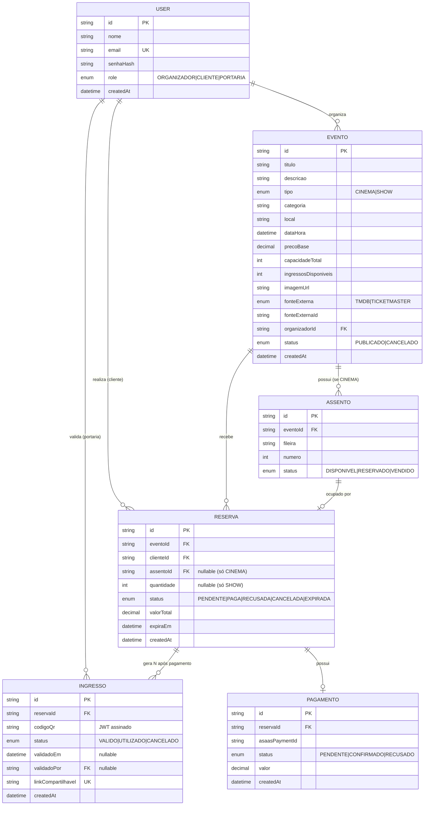

# Especificação Técnica

> Detalhamento de como cada funcionalidade é implementada: modelo de dados,
> endpoints da API, e as regras técnicas que garantem a integridade do
> sistema (concorrência, anti-forjamento de QR, etc).

## 1. Modelo de Dados

### 1.1 User

Entidade base para os três papéis do sistema.

| Campo | Tipo | Observação |
|---|---|---|
| id | string (uuid/cuid) | |
| nome | string | |
| email | string | único |
| senhaHash | string | hash via bcrypt |
| role | enum | `ORGANIZADOR` \| `CLIENTE` \| `PORTARIA` |
| createdAt | datetime | |

### 1.2 Evento

Representa tanto um filme (cinema) quanto um show, unificados por um campo de
tipo.

| Campo | Tipo | Observação |
|---|---|---|
| id | string | |
| titulo | string | |
| descricao | string | |
| tipo | enum | `CINEMA` \| `SHOW` — determina o fluxo de reserva |
| categoria | string | usado no filtro (ex: "Ação", "Rock", "Teatro") |
| local | string | |
| dataHora | datetime | |
| precoBase | decimal | preço unitário do ingresso — único para todo o evento (não há preço por assento ou setor) |
| capacidadeTotal | int | CINEMA: igual ao total de assentos gerados. SHOW: capacidade da pista |
| ingressosDisponiveis | int | **Somente SHOW** — controla o estoque. Em eventos CINEMA a disponibilidade é derivada da contagem de assentos com `status = DISPONIVEL`, e este campo é ignorado |
| imagemUrl | string | |
| fonteExterna | enum | `TMDB` \| `TICKETMASTER` |
| fonteExternaId | string | id do item no catálogo de origem |
| organizadorId | string | FK → User |
| status | enum | `PUBLICADO` \| `CANCELADO` |
| createdAt | datetime | |

### 1.3 Assento

Aplicável apenas a eventos do tipo `CINEMA`.

| Campo | Tipo | Observação |
|---|---|---|
| id | string | |
| eventoId | string | FK → Evento |
| fileira | string | ex: "A", "B" |
| numero | int | ex: 1, 2, 3 |
| status | enum | `DISPONIVEL` \| `RESERVADO` \| `VENDIDO` |

Constraint: `@@unique([eventoId, fileira, numero])` — impede duplicidade de
assento no mesmo evento.

### 1.4 Reserva

Intenção de compra, criada antes da confirmação de pagamento.

| Campo | Tipo | Observação |
|---|---|---|
| id | string | |
| eventoId | string | FK → Evento |
| clienteId | string | FK → User |
| assentoId | string \| null | preenchido apenas se `evento.tipo == CINEMA` |
| quantidade | int \| null | preenchido apenas se `evento.tipo == SHOW` |
| status | enum | `PENDENTE` \| `PAGA` \| `RECUSADA` \| `CANCELADA` \| `EXPIRADA` |
| valorTotal | decimal | |
| expiraEm | datetime | `createdAt + 15 min` — prazo para confirmar pagamento (PRD §3.10) |
| createdAt | datetime | |

### 1.5 Ingresso

Gerado após confirmação de pagamento. **Uma reserva gera N ingressos**: um
por assento (CINEMA) ou um por unidade da quantidade reservada (SHOW), cada
um com QR e ciclo de validação independentes (PRD §3.7).

| Campo | Tipo | Observação |
|---|---|---|
| id | string | |
| reservaId | string | FK → Reserva (1:N — uma reserva, N ingressos) |
| codigoQr | string | JWT assinado (payload: `ingressoId`, `eventoId`) |
| status | enum | `VALIDO` \| `UTILIZADO` \| `CANCELADO` |
| validadoEm | datetime \| null | |
| validadoPor | string \| null | FK → User (usuário de portaria) |
| linkCompartilhavel | string | token único para acesso via link |
| createdAt | datetime | |

### 1.6 Pagamento

Registro da transação simulada via Asaas sandbox.

| Campo | Tipo | Observação |
|---|---|---|
| id | string | |
| reservaId | string | FK → Reserva (1:1) |
| asaasPaymentId | string | referência no sandbox Asaas |
| status | enum | `PENDENTE` \| `CONFIRMADO` \| `RECUSADO` |
| valor | decimal | |
| createdAt | datetime | |

### 1.7 Diagrama Entidade-Relacionamento



**Notas sobre o modelo:**

- `Assento` só é populado para eventos do tipo `CINEMA`; eventos do tipo
  `SHOW` controlam disponibilidade pelo campo `ingressosDisponiveis` em
  `Evento`.
- `Reserva` usa `assentoId` **ou** `quantidade`, nunca ambos — o campo
  preenchido depende de `evento.tipo`.
- `Ingresso` só é criado após `Pagamento.status = CONFIRMADO`, em quantidade
  igual ao número de entradas da reserva (1 para CINEMA, N para SHOW).
- `Reserva.expiraEm` controla a janela de 15 minutos para pagamento; após
  esse prazo a reserva é expirada e o estoque devolvido (ver §2.3).
- `Evento.ingressosDisponiveis` só tem significado em eventos `SHOW`. Em
  eventos `CINEMA`, a disponibilidade é sempre calculada pela contagem de
  `Assento` com `status = DISPONIVEL`, evitando dois lugares de verdade para
  a mesma informação.
- `Pagamento` mantém relação 1:1 com `Reserva`: um pagamento recusado
  encerra a reserva, sem retentativa (ver §4.3).
- `validadoPor` referencia o usuário de portaria que realizou a validação,
  servindo como trilha de auditoria.

## 2. Regras de Concorrência

### 2.1 Evento tipo CINEMA (reserva por assento)

Dentro de uma `prisma.$transaction`:

1. **Update condicional** no assento — `updateMany` com
   `WHERE id = :assentoId AND status = 'DISPONIVEL'`, definindo
   `status = 'RESERVADO'`
2. Verificar o `count` retornado:
   - `count === 1` → o assento era realmente do requisitante; prosseguir
   - `count === 0` → outro cliente venceu a disputa; abortar a transação e
     retornar **409 Conflict**
3. Criar a `Reserva` com `expiraEm = now() + 15 min`

> O que garante a exclusividade é o **update condicional dentro da
> transação**, não a constraint `@@unique([eventoId, fileira, numero])` — essa
> constraint impede assentos duplicados no cadastro do evento, e não teria
> efeito sobre duas reservas concorrentes. Ao embutir a condição
> `status = 'DISPONIVEL'` na própria escrita, o banco resolve a disputa
> atomicamente: apenas uma das transações concorrentes afeta a linha.

### 2.2 Evento tipo SHOW (reserva por quantidade)

Dentro de uma `prisma.$transaction`:
1. Verificar que `ingressosDisponiveis >= quantidade` solicitada
2. Decrementar `ingressosDisponiveis` e criar a `Reserva`, atomicamente
3. Isso evita overselling quando múltiplos clientes reservam
   simultaneamente

### 2.3 Expiração Lazy de Reservas

Implementada como uma verificação executada **antes** de qualquer operação
que dependa da disponibilidade de um evento:

- `GET /eventos/:id/assentos`
- `GET /eventos/:id`
- `POST /reservas/assento`
- `POST /reservas/quantidade`

Procedimento (dentro da mesma transação da operação principal):
1. Buscar reservas do evento com `status = PENDENTE` e `expiraEm < now()`
2. Atualizar essas reservas para `status = EXPIRADA`
3. Devolver o estoque: assentos → `DISPONIVEL`; quantidade → incrementar
   `ingressosDisponiveis`

> Não requer cron job ou worker: a correção só precisa ser garantida no
> momento em que a disponibilidade é lida ou disputada (PRD §3.10).

## 3. QR Code — Geração e Validação

### 3.1 Geração
- Após confirmação do pagamento, gerar **um ingresso por entrada** (1 para
  CINEMA; N para SHOW, conforme `Reserva.quantidade`)
- Para cada ingresso, gerar um JWT assinado com a chave secreta do servidor,
  payload: `{ ingressoId, eventoId }`
- Esse JWT (texto) é codificado visualmente em QR via lib `qrcode`
- O JWT também é armazenado no campo `codigoQr` do `Ingresso`, para
  referência/auditoria

### 3.2 Validação (endpoint de portaria)
1. Recebe o código lido (via câmera ou digitação manual)
2. Verifica a assinatura do JWT (`jwt.verify`) — se inválida, retorna
   **inválido** imediatamente, sem consultar o banco
3. Se válida, busca o `Ingresso` correspondente ao `ingressoId`
4. Confere se o `eventoId` do token bate com o `eventoId` enviado no corpo da
   requisição (o evento selecionado pelo usuário de portaria no início da
   sessão) — se não, retorna **evento errado**
5. Confere `status`:
   - `UTILIZADO` → retorna **já utilizado**
   - `CANCELADO` → retorna **inválido** (reserva cancelada ou evento
     cancelado pelo organizador)
   - `VALIDO` → marca como `UTILIZADO`, registra `validadoEm` e
     `validadoPor`, retorna **válido**

A marcação como `UTILIZADO` ocorre dentro de uma transação com verificação
condicional (`WHERE status = 'VALIDO'`), impedindo que duas leituras
simultâneas do mesmo QR sejam ambas aceitas.

## 4. Cancelamento, Estoque e Transições de Status

### 4.0 Cancelamento pelo Cliente

1. Validar que a requisição vem do cliente dono da reserva
2. Validar que `dataHora do evento - agora >= 24h` (ver regra completa em
   `docs/PRD.md`)
3. Dentro de uma transação:
   - Atualizar `Reserva.status` para `CANCELADA`
   - Se `CINEMA`: devolver o `Assento` para `DISPONIVEL`
   - Se `SHOW`: incrementar `ingressosDisponiveis` de volta
   - Atualizar **todos** os `Ingresso` vinculados à reserva para `CANCELADO`

### 4.1 Cancelamento de Evento pelo Organizador

`DELETE /eventos/:id` — executa em cascata, dentro de uma transação
(PRD §3.11):

1. Validar que o requisitante é o organizador dono do evento
2. `Evento.status → CANCELADO`
3. Todas as `Reserva` com status `PENDENTE` ou `PAGA` → `CANCELADA`
4. Todos os `Ingresso` com status `VALIDO` → `CANCELADO`
5. Reservas que estavam `PAGA` geram reembolso total simulado — **a janela
   de 24h não se aplica**, pois o cancelamento partiu do organizador
6. Ingressos `UTILIZADO` permanecem inalterados (trilha de auditoria)
7. Assentos do evento voltam a `DISPONIVEL`

### 4.2 Transições de Status

Referência única de quando cada status muda, para evitar ambiguidade na
implementação.

**`Assento`**

| De | Para | Quando |
|---|---|---|
| `DISPONIVEL` | `RESERVADO` | Reserva criada (§2.1) |
| `RESERVADO` | `VENDIDO` | Pagamento confirmado |
| `RESERVADO` | `DISPONIVEL` | Reserva expirada (§2.3) ou pagamento recusado |
| `VENDIDO` | `DISPONIVEL` | Cancelamento pelo cliente (§4) ou do evento (§4.1) |

**`Reserva`**

| De | Para | Quando |
|---|---|---|
| — | `PENDENTE` | Reserva criada, com `expiraEm = now() + 15 min` |
| `PENDENTE` | `PAGA` | Pagamento confirmado |
| `PENDENTE` | `RECUSADA` | Pagamento recusado — encerra a reserva |
| `PENDENTE` | `EXPIRADA` | 15 minutos sem confirmação (§2.3) |
| `PENDENTE`/`PAGA` | `CANCELADA` | Cancelamento pelo cliente (§4) ou do evento (§4.1) |

**`Ingresso`**

| De | Para | Quando |
|---|---|---|
| — | `VALIDO` | Criado na confirmação do pagamento (1 por entrada) |
| `VALIDO` | `UTILIZADO` | Validado na portaria (§3.2) |
| `VALIDO` | `CANCELADO` | Cancelamento pelo cliente (§4) ou do evento (§4.1) |

### 4.3 Pagamento Recusado

Decisão de produto: **um pagamento recusado encerra a reserva.** Não há
retentativa sobre a mesma reserva — o cliente refaz o fluxo do início.

- `Reserva.status → RECUSADA`
- Assento volta a `DISPONIVEL` (CINEMA) ou a quantidade é devolvida ao
  estoque (SHOW)
- Nenhum `Ingresso` é gerado

> Isso mantém a relação `Reserva 1:1 Pagamento`: uma reserva tem no máximo
> uma tentativa de cobrança. Permitir retentativa exigiria manter o lugar
> bloqueado por tempo indeterminado após uma falha de pagamento, o que
> conflita com a liberação imediata do estoque — preferimos devolver o lugar
> ao mercado e deixar o cliente reservar novamente.

## 5. Rotas da API

### 5.1 Autenticação
```
POST   /auth/registro                [público]      cria usuário (sempre role=CLIENTE)
POST   /auth/login                   [público]      retorna JWT
GET    /auth/me                      [autenticado]  dados do usuário logado
```

### 5.2 Eventos
```
GET    /eventos                      [público]      lista com filtros:
                                                      ?data=&categoria=&local=&precoMin=&precoMax=
GET    /eventos/:id                  [público]      detalhe (+ assentos, se CINEMA)
POST   /eventos                      [organizador]  cria evento
PUT    /eventos/:id                  [organizador]  edita evento
DELETE /eventos/:id                  [organizador]  cancela evento

GET    /catalogo/filmes              [organizador]  busca no TMDb
GET    /catalogo/shows               [organizador]  busca no Ticketmaster
```

### 5.3 Assentos
```
GET    /eventos/:id/assentos         [público]      mapa de assentos + status
```

### 5.4 Reservas
```
POST   /reservas/assento             [cliente]      reserva assento (CINEMA)
POST   /reservas/quantidade          [cliente]      reserva N ingressos (SHOW)
POST   /reservas/:id/cancelar        [cliente]      cancela (regra 24h) + devolve estoque
GET    /reservas/minhas              [cliente]      lista reservas do cliente logado
```

### 5.5 Pagamento
```
POST   /pagamentos/:reservaId/processar   [cliente]  dispara cobrança simulada (Asaas)
GET    /pagamentos/:id                    [cliente]  status do pagamento (usado em polling)
POST   /webhooks/asaas                    [público]  callback do Asaas (ativo em produção)
POST   /pagamentos/:id/simular-callback   [cliente]  dispara o handler do webhook manualmente
                                                       (desenvolvimento e testes)
```

**Estratégia de confirmação de pagamento**

O webhook do Asaas não alcança um servidor em `localhost`, o que
inviabilizaria testar o fluxo sem um túnel público. A confirmação foi
desenhada em três camadas:

1. **Polling (caminho principal)** — o front consulta `GET /pagamentos/:id`
   periodicamente até o status sair de `PENDENTE`. Funciona em qualquer
   ambiente, sem dependência externa.
2. **Webhook** — implementado e registrado apenas no ambiente publicado,
   onde a URL é acessível pelo Asaas.
3. **`simular-callback`** — invoca o mesmo handler do webhook, permitindo
   exercitar a lógica de confirmação/recusa em desenvolvimento e nos testes
   automatizados.

### 5.6 Ingressos
```
GET    /ingressos/meus                        [cliente]  lista "Meus Ingressos"
GET    /ingressos/:id                         [cliente]  detalhe + QR
GET    /ingressos/compartilhar/:linkToken     [público]  visualização via link
```

### 5.7 Portaria
```
POST   /portaria/validar             [portaria]     valida código no contexto de um evento
                                                      body: { codigo, eventoId }
                                                      retorna: valido | invalido |
                                                      ja_utilizado | evento_errado
```

`eventoId` corresponde ao evento selecionado pelo usuário de portaria no
início da sessão (PRD §3.9) e é o que permite distinguir um ingresso válido
de outro evento (`evento_errado`) de um ingresso inválido.

### 5.8 Integrações Externas — Rate Limit e Cache

TMDb e Ticketmaster Discovery impõem limites de requisição. Para evitar
esgotá-los durante o uso do painel do organizador:

- **Debounce no front-end** (~400ms) nos campos de busca do catálogo, para
  não disparar uma requisição por tecla digitada
- **Cache em memória no back-end** das respostas do catálogo, com TTL curto
  (~5 min), chaveado pelos parâmetros da busca
- Erros de rate limit (HTTP 429) são tratados e retornados com mensagem
  clara, em vez de falhar silenciosamente

## 6. Testes (foco de cobertura)

Priorização, do mais crítico para o mais opcional:
1. Concorrência de reserva de assento (dois clientes, mesmo assento)
2. Concorrência de reserva por quantidade (overselling)
3. Geração e validação de QR (assinatura válida vs. forjada)
4. Regra de cancelamento (dentro e fora da janela de 24h)
5. Expiração de reserva não paga após 15 minutos, com devolução ao estoque
6. Geração de N ingressos a partir de uma reserva de quantidade N
7. Cancelamento de evento em cascata (reservas e ingressos)
8. Rotas principais de criação de evento e reserva (testes de integração)

Os testes que exercitam concorrência e transações devem rodar contra uma
instância real de PostgreSQL (a mesma do Docker Compose, em banco de teste
separado) — mocks de ORM não exercitam o comportamento transacional que
está sendo verificado.
