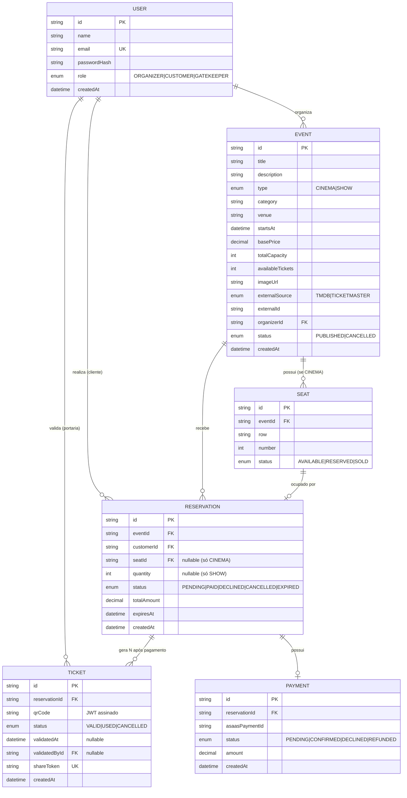

# Especificação Técnica

> Detalhamento de como cada funcionalidade é implementada: modelo de dados,
> endpoints da API, e as regras técnicas que garantem a integridade do
> sistema (concorrência, anti-forjamento de QR, etc).

## 1. Modelo de Dados

### 1.1 User

Entidade base para os três papéis do sistema.

| Campo | Tipo | Observação |
|---|---|---|
| id | string (uuid/cuid) | |
| name | string | |
| email | string | único |
| passwordHash | string | hash via bcrypt |
| role | enum | `ORGANIZER` \| `CUSTOMER` \| `GATEKEEPER` |
| createdAt | datetime | |

### 1.2 Event

Representa tanto um filme (cinema) quanto um show, unificados por um campo de
tipo.

| Campo | Tipo | Observação |
|---|---|---|
| id | string | |
| title | string | |
| description | string | |
| type | enum | `CINEMA` \| `SHOW` — determina o fluxo de reserva |
| category | string | usado no filtro (ex: "Ação", "Rock", "Teatro") |
| venue | string | local do evento |
| startsAt | datetime | data e hora do evento |
| basePrice | decimal | preço unitário do ingresso — único para todo o evento (não há preço por assento ou setor) |
| totalCapacity | int | CINEMA: igual ao total de assentos gerados. SHOW: capacidade da pista |
| availableTickets | int | **Somente SHOW** — controla o estoque. Em eventos CINEMA a disponibilidade é derivada da contagem de assentos com `status = AVAILABLE`, e este campo é ignorado |
| imageUrl | string | |
| externalSource | enum | `TMDB` \| `TICKETMASTER` |
| externalId | string | id do item no catálogo de origem |
| organizerId | string | FK → User |
| status | enum | `PUBLISHED` \| `CANCELLED` |
| createdAt | datetime | |

### 1.3 Seat

Aplicável apenas a eventos do tipo `CINEMA`.

| Campo | Tipo | Observação |
|---|---|---|
| id | string | |
| eventId | string | FK → Event |
| row | string | ex: "A", "B" |
| number | int | ex: 1, 2, 3 |
| status | enum | `AVAILABLE` \| `RESERVED` \| `SOLD` |

Constraint: `@@unique([eventId, row, number])` — impede duplicidade de assento
no mesmo evento.

### 1.4 Reservation

Intenção de compra, criada antes da confirmação de pagamento.

| Campo | Tipo | Observação |
|---|---|---|
| id | string | |
| eventId | string | FK → Event |
| customerId | string | FK → User |
| seatId | string \| null | preenchido apenas se `event.type == CINEMA` |
| quantity | int \| null | preenchido apenas se `event.type == SHOW` |
| status | enum | `PENDING` \| `PAID` \| `DECLINED` \| `CANCELLED` \| `EXPIRED` |
| totalAmount | decimal | |
| expiresAt | datetime | `createdAt + 15 min` — prazo para confirmar pagamento (PRD §3.10) |
| createdAt | datetime | |

### 1.5 Ticket

Gerado após confirmação de pagamento. **Uma reserva gera N ingressos**: um
por assento (CINEMA) ou um por unidade da quantidade reservada (SHOW), cada
um com QR e ciclo de validação independentes (PRD §3.7).

| Campo | Tipo | Observação |
|---|---|---|
| id | string | |
| reservationId | string | FK → Reservation (1:N — uma reserva, N ingressos) |
| qrCode | string | JWT assinado (payload: `ticketId`, `eventId`) |
| status | enum | `VALID` \| `USED` \| `CANCELLED` |
| validatedAt | datetime \| null | |
| validatedById | string \| null | FK → User (usuário de portaria). No schema Prisma existe também o campo de relação `validatedBy`, que navega até o `User` — a coluna e a navegação precisam de nomes distintos |
| shareToken | string | token único para acesso via link |
| createdAt | datetime | |

### 1.6 Payment

Registro da transação simulada via Asaas sandbox.

| Campo | Tipo | Observação |
|---|---|---|
| id | string | |
| reservationId | string | FK → Reservation (1:1) |
| asaasPaymentId | string | referência no sandbox Asaas |
| status | enum | `PENDING` \| `CONFIRMED` \| `DECLINED` \| `REFUNDED` |
| amount | decimal | |
| createdAt | datetime | |

### 1.7 Diagrama Entidade-Relacionamento



**Notas sobre o modelo:**

- `Seat` só é populado para eventos do tipo `CINEMA`; eventos do tipo `SHOW`
  controlam disponibilidade pelo campo `availableTickets` em `Event`.
- `Reservation` usa `seatId` **ou** `quantity`, nunca ambos — o campo
  preenchido depende de `event.type`.
- `Ticket` só é criado após `Payment.status = CONFIRMED`, em quantidade igual
  ao número de entradas da reserva (1 para CINEMA, N para SHOW).
- `Reservation.expiresAt` controla a janela de 15 minutos para pagamento; após
  esse prazo a reserva é expirada e o estoque devolvido (ver §2.3).
- `Event.availableTickets` só tem significado em eventos `SHOW`. Em eventos
  `CINEMA`, a disponibilidade é sempre calculada pela contagem de `Seat` com
  `status = AVAILABLE`, evitando dois lugares de verdade para a mesma
  informação.
- `Payment` mantém relação 1:1 com `Reservation`: um pagamento recusado
  encerra a reserva, sem retentativa (ver §4.3).
- `validatedById` referencia o usuário de portaria que realizou a validação,
  servindo como trilha de auditoria.

**Escolhas feitas na tradução para o schema:**

- **Valores monetários** (`basePrice`, `totalAmount`, `amount`) usam
  `Decimal(10, 2)`. A especificação dizia apenas "decimal"; duas casas
  cobrem centavos e dez dígitos comportam qualquer preço plausível de
  ingresso.
- **Índices além dos automáticos**, escolhidos a partir das consultas que o
  sistema vai fazer: `[status, startsAt]` em `Event` (a listagem pública
  filtra pelos dois), `[eventId, status]` em `Seat` (o mapa de assentos),
  `[eventId, status, expiresAt]` em `Reservation` (a expiração de reservas
  vencidas varre exatamente esses três campos) e `[customerId]` para "minhas
  reservas".
- **`shareToken` nasce preenchido**, com valor gerado pelo próprio banco —
  não precisa de código para criá-lo.
- **Apagar um evento em cascata só alcança os assentos.** Nas demais
  relações, apagar um registro que tenha reservas falha de propósito:
  histórico de compra não deve sumir em silêncio. Na prática o sistema nunca
  apaga eventos, apenas os cancela.

## 2. Regras de Concorrência

### 2.1 Evento tipo CINEMA (reserva por assento)

Dentro de uma `prisma.$transaction`:

1. **Update condicional** no assento — `updateMany` com
   `WHERE id = :seatId AND status = 'AVAILABLE'`, definindo
   `status = 'RESERVED'`
2. Verificar o `count` retornado:
   - `count === 1` → o assento era realmente do requisitante; prosseguir
   - `count === 0` → outro cliente venceu a disputa; abortar a transação e
     retornar **409 Conflict**
3. Criar a `Reservation` com `expiresAt = now() + 15 min`

> O que garante a exclusividade é o **update condicional dentro da
> transação**, não a constraint `@@unique([eventId, row, number])` — essa
> constraint impede assentos duplicados no cadastro do evento, e não teria
> efeito sobre duas reservas concorrentes. Ao embutir a condição
> `status = 'AVAILABLE'` na própria escrita, o banco resolve a disputa
> atomicamente: apenas uma das transações concorrentes afeta a linha.

### 2.2 Evento tipo SHOW (reserva por quantidade)

Dentro de uma `prisma.$transaction`:
1. Verificar que `availableTickets >= quantity` solicitada
2. Decrementar `availableTickets` e criar a `Reservation`, atomicamente
3. Isso evita overselling quando múltiplos clientes reservam
   simultaneamente

### 2.3 Expiração Lazy de Reservas

Implementada como uma verificação executada **antes** de qualquer operação
que dependa da disponibilidade de um evento:

- `GET /eventos/:id/assentos`
- `GET /eventos/:id`
- `POST /reservas/assento`
- `POST /reservas/quantidade`

Procedimento (dentro da mesma transação da operação principal):
1. Buscar reservas do evento com `status = PENDING` e `expiresAt < now()`
2. Atualizar essas reservas para `status = EXPIRED`
3. Devolver o estoque: assentos → `AVAILABLE`; quantidade → incrementar
   `availableTickets`

> Não requer cron job ou worker: a correção só precisa ser garantida no
> momento em que a disponibilidade é lida ou disputada (PRD §3.10).

## 3. QR Code — Geração e Validação

### 3.1 Geração
- Após confirmação do pagamento, gerar **um ingresso por entrada** (1 para
  CINEMA; N para SHOW, conforme `Reservation.quantity`)
- Para cada ingresso, gerar um JWT assinado com a chave secreta do servidor,
  payload: `{ ticketId, eventId }`
- Esse JWT (texto) é codificado visualmente em QR via lib `qrcode`
- O JWT também é armazenado no campo `qrCode` do `Ticket`, para
  referência/auditoria

### 3.2 Validação (endpoint de portaria)
1. Recebe o código lido (via câmera ou digitação manual)
2. Verifica a assinatura do JWT (`jwt.verify`) — se inválida, retorna
   **inválido** imediatamente, sem consultar o banco
3. Se válida, busca o `Ticket` correspondente ao `ticketId`
4. Confere se o `eventId` do token bate com o `eventId` enviado no corpo da
   requisição (o evento selecionado pelo usuário de portaria no início da
   sessão) — se não, retorna **evento errado**
5. Confere `status`:
   - `USED` → retorna **já utilizado**
   - `CANCELLED` → retorna **inválido** (reserva cancelada ou evento
     cancelado pelo organizador)
   - `VALID` → marca como `USED`, registra `validatedAt` e
     `validatedById`, retorna **válido**

A marcação como `USED` ocorre dentro de uma transação com verificação
condicional (`WHERE status = 'VALID'`), impedindo que duas leituras
simultâneas do mesmo QR sejam ambas aceitas.

## 4. Cancelamento, Estoque e Transições de Status

### 4.0 Cancelamento pelo Cliente

1. Validar que a requisição vem do cliente dono da reserva
2. Validar que `startsAt do evento - agora >= 24h` (ver regra completa em
   `docs/PRD.md`)
3. Dentro de uma transação:
   - Atualizar `Reservation.status` para `CANCELLED`
   - Se `CINEMA`: devolver o `Seat` para `AVAILABLE`
   - Se `SHOW`: incrementar `availableTickets` de volta
   - Atualizar **todos** os `Ticket` vinculados à reserva para `CANCELLED`
   - Chamar o estorno na Asaas sandbox (`POST /payments/:id/refund`) e
     atualizar `Payment.status` para `REFUNDED`

### 4.1 Cancelamento de Evento pelo Organizador

`DELETE /eventos/:id` — executa em cascata, dentro de uma transação
(PRD §3.11):

1. Validar que o requisitante é o organizador dono do evento
2. `Event.status → CANCELLED`
3. Todas as `Reservation` com status `PENDING` ou `PAID` → `CANCELLED`
4. Todos os `Ticket` com status `VALID` → `CANCELLED`
5. Reservas que estavam `PAID` geram reembolso total simulado — mesma
   chamada de estorno do §4.0 (`POST /payments/:id/refund` na Asaas
   sandbox, `Payment.status → REFUNDED`) — **a janela de 24h não se
   aplica**, pois o cancelamento partiu do organizador
6. Ingressos `USED` permanecem inalterados (trilha de auditoria)
7. Assentos do evento voltam a `AVAILABLE`

### 4.2 Transições de Status

Referência única de quando cada status muda, para evitar ambiguidade na
implementação.

**`Seat`**

| De | Para | Quando |
|---|---|---|
| `AVAILABLE` | `RESERVED` | Reserva criada (§2.1) |
| `RESERVED` | `SOLD` | Pagamento confirmado |
| `RESERVED` | `AVAILABLE` | Reserva expirada (§2.3) ou pagamento recusado |
| `SOLD` | `AVAILABLE` | Cancelamento pelo cliente (§4) ou do evento (§4.1) |

**`Reservation`**

| De | Para | Quando |
|---|---|---|
| — | `PENDING` | Reserva criada, com `expiresAt = now() + 15 min` |
| `PENDING` | `PAID` | Pagamento confirmado |
| `PENDING` | `DECLINED` | Pagamento recusado — encerra a reserva |
| `PENDING` | `EXPIRED` | 15 minutos sem confirmação (§2.3) |
| `PENDING`/`PAID` | `CANCELLED` | Cancelamento pelo cliente (§4) ou do evento (§4.1) |

**`Ticket`**

| De | Para | Quando |
|---|---|---|
| — | `VALID` | Criado na confirmação do pagamento (1 por entrada) |
| `VALID` | `USED` | Validado na portaria (§3.2) |
| `VALID` | `CANCELLED` | Cancelamento pelo cliente (§4) ou do evento (§4.1) |

**`Payment`**

| De | Para | Quando |
|---|---|---|
| — | `PENDING` | Cobrança criada na Asaas sandbox |
| `PENDING` | `CONFIRMED` | Pagamento confirmado (webhook, polling ou simulação) |
| `PENDING` | `DECLINED` | Pagamento recusado (§4.3) |
| `CONFIRMED` | `REFUNDED` | Cancelamento pelo cliente (§4.0) ou do evento (§4.1) — estorno na Asaas sandbox |

### 4.3 Pagamento Recusado

Decisão de produto: **um pagamento recusado encerra a reserva.** Não há
retentativa sobre a mesma reserva — o cliente refaz o fluxo do início.

- `Reservation.status → DECLINED`
- Assento volta a `AVAILABLE` (CINEMA) ou a quantidade é devolvida ao
  estoque (SHOW)
- Nenhum `Ticket` é gerado

> Isso mantém a relação `Reservation 1:1 Payment`: uma reserva tem no máximo
> uma tentativa de cobrança. Permitir retentativa exigiria manter o lugar
> bloqueado por tempo indeterminado após uma falha de pagamento, o que
> conflita com a liberação imediata do estoque — preferimos devolver o lugar
> ao mercado e deixar o cliente reservar novamente.

## 5. Rotas da API

### 5.1 Autenticação
```
POST   /auth/registro                [público]      cria usuário (sempre role=CUSTOMER)
POST   /auth/login                   [público]      retorna JWT
GET    /auth/me                      [autenticado]  dados do usuário logado
```

### 5.2 Eventos
```
GET    /eventos                      [público]      lista com filtros:
                                                      ?date=&category=&venue=&minPrice=&maxPrice=
GET    /eventos/:id                  [público]      detalhe (+ assentos, se CINEMA)
POST   /eventos                      [organizador]  cria evento
PUT    /eventos/:id                  [organizador]  edita evento
DELETE /eventos/:id                  [organizador]  cancela evento

GET    /catalogo/filmes              [organizador]  busca no TMDb
GET    /catalogo/shows               [organizador]  busca no Ticketmaster
```

### 5.3 Assentos
```
GET    /eventos/:id/assentos         [público]      mapa de assentos + status
```

### 5.4 Reservas
```
POST   /reservas/assento             [cliente]      reserva assento (CINEMA)
POST   /reservas/quantidade          [cliente]      reserva N ingressos (SHOW)
POST   /reservas/:id/cancelar        [cliente]      cancela (regra 24h) + devolve estoque
GET    /reservas/minhas              [cliente]      lista reservas do cliente logado
```

### 5.5 Pagamento
```
POST   /pagamentos/:reservationId/processar   [cliente]  dispara cobrança simulada (Asaas)
GET    /pagamentos/:id                    [cliente]  status do pagamento (usado em polling)
POST   /webhooks/asaas                    [público]  callback do Asaas (ativo em produção)
POST   /pagamentos/:id/simular-callback   [cliente]  dispara o handler do webhook manualmente
                                                       (desenvolvimento e testes)
```

**Estratégia de confirmação de pagamento**

O webhook do Asaas não alcança um servidor em `localhost`, o que
inviabilizaria testar o fluxo sem um túnel público. A confirmação foi
desenhada em três camadas:

1. **Polling (caminho principal)** — o front consulta `GET /pagamentos/:id`
   periodicamente até o status sair de `PENDING`. Funciona em qualquer
   ambiente, sem dependência externa.
2. **Webhook** — implementado e registrado apenas no ambiente publicado,
   onde a URL é acessível pelo Asaas.
3. **`simular-callback`** — invoca o mesmo handler do webhook, permitindo
   exercitar a lógica de confirmação/recusa em desenvolvimento e nos testes
   automatizados.

### 5.6 Ingressos
```
GET    /ingressos/meus                        [cliente]  lista "Meus Ingressos"
GET    /ingressos/:id                         [cliente]  detalhe + QR
GET    /ingressos/compartilhar/:shareToken     [público]  visualização via link
```

### 5.7 Portaria
```
POST   /portaria/validar             [portaria]     valida código no contexto de um evento
                                                      body: { code, eventId }
                                                      retorna: valid | invalid |
                                                      already_used | wrong_event
```

`eventId` corresponde ao evento selecionado pelo usuário de portaria no
início da sessão (PRD §3.9) e é o que permite distinguir um ingresso válido
de outro evento (`wrong_event`) de um ingresso inválido.

### 5.8 Integrações Externas — Rate Limit e Cache

TMDb e Ticketmaster Discovery impõem limites de requisição. Para evitar
esgotá-los durante o uso do painel do organizador:

- **Debounce no front-end** (~400ms) nos campos de busca do catálogo, para
  não disparar uma requisição por tecla digitada
- **Cache em memória no back-end** das respostas do catálogo, com TTL curto
  (~5 min), chaveado pelos parâmetros da busca
- Erros de rate limit (HTTP 429) são tratados e retornados com mensagem
  clara, em vez de falhar silenciosamente

## 6. Testes (foco de cobertura)

Priorização, do mais crítico para o mais opcional:
1. Concorrência de reserva de assento (dois clientes, mesmo assento)
2. Concorrência de reserva por quantidade (overselling)
3. Geração e validação de QR (assinatura válida vs. forjada)
4. Regra de cancelamento (dentro e fora da janela de 24h)
5. Expiração de reserva não paga após 15 minutos, com devolução ao estoque
6. Geração de N ingressos a partir de uma reserva de quantidade N
7. Cancelamento de evento em cascata (reservas e ingressos)
8. Rotas principais de criação de evento e reserva (testes de integração)

Os testes que exercitam concorrência e transações devem rodar contra uma
instância real de PostgreSQL (a mesma do Docker Compose, em banco de teste
separado) — mocks de ORM não exercitam o comportamento transacional que
está sendo verificado.
